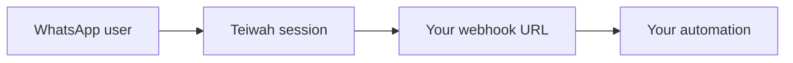

When the connected WhatsApp number receives a message, Teiwah delivers it to your webhook URL. You set the webhook URL per session in the dashboard.



## Payload shape

Inbound webhooks use the same explicit `message.type` as outbound messages, so routing in tools like n8n is straightforward.

Text:

```json
{
  "id": "3EB0C767D7A0D9D8F8A1",
  "from": "972501234567",
  "timestamp": 1749420000,
  "message": {
    "type": "text",
    "body": "Hello"
  }
}
```

Image:

```json
{
  "id": "3EB0C767D7A0D9D8F8A1",
  "from": "972501234567",
  "timestamp": 1749420000,
  "message": {
    "type": "image",
    "mediaUrl": "https://api.teiwah.cloud/media/k7P3x9LmQ2",
    "mimeType": "image/jpeg",
    "caption": "Look"
  }
}
```

## Replying

The golden rule for replies:

```text
webhook.from  ->  POST /messages.to
```

Take the `from` value from the webhook and use it directly as `to` when sending a reply. For 1:1 conversations this is the cleanest replyable address (a bare phone number when available).

## Message ids

`id` is the native WhatsApp message id. Use it for deduplication, logging, and correlation.

## Inbound media

Inbound webhooks never contain raw media bytes. Media is represented as a Teiwah `mediaUrl`. Download it on demand only if you need it — see [Working with media](/guides/media/).

## Scope

Group messages are out of scope for v1. Webhooks and the reply rule above apply to 1:1 conversations.
