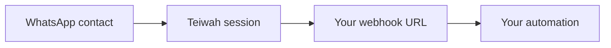

When the connected WhatsApp number receives a message, Teiwah delivers it to
your webhook URL. You set the webhook URL per session in the dashboard.



## Payload shape

The body mirrors the outbound shape (`chatId` + `text`/`media`) and adds delivery
metadata: a `sessionId`, the native `id`, a `timestamp`, the group `participant`,
and `contact`. Each message is either text or media.

Text (1:1):

```json
{
  "sessionId": "happy-otter-1a2b",
  "id": "3EB0C767D7A0D9D8F8A1",
  "chatId": "972501234567@s.whatsapp.net",
  "participant": null,
  "contact": { "name": "Roman S.", "phoneNumber": "972501234567" },
  "timestamp": 1749420000,
  "text": "Hello"
}
```

Image:

```json
{
  "sessionId": "happy-otter-1a2b",
  "id": "3EB0C767D7A0D9D8F8A1",
  "chatId": "972501234567@s.whatsapp.net",
  "participant": null,
  "contact": { "name": "Roman S.", "phoneNumber": "972501234567" },
  "timestamp": 1749420000,
  "media": {
    "type": "image",
    "url": "https://api.teiwah.cloud/media/k7P3x9LmQ2",
    "mimeType": "image/jpeg",
    "caption": "Look"
  }
}
```

## Field notes

- **`sessionId`** — identifies the WhatsApp session, so one shared endpoint can
  fan in multiple sessions.
- **`id`** — native WhatsApp message id. Use it for deduplication, logging, and
  correlation, and pass it back as `quoteMessageId` (to reply-quote), as the
  `/read` `messageId`, or as the `/media/:id` key.
- **`chatId`** — the conversation reply address; pass it back as `chatId` to
  reply.
- **`participant`** — in a group, the sender's own address; `null` in a 1:1.
- **`contact`** — sender metadata only, never a send target: `name` (display name,
  best-effort) and `phoneNumber` (bare digits, or `null` when WhatsApp provides
  no mapping).

## Replying

The golden rule for replies:

```text
webhook.chatId  ->  POST /messages.chatId
```

Take the `chatId` value from the webhook and use it directly as `chatId` when
sending a reply. Because the contact messaged you first, the reply is always
allowed (see [Trusted contacts](/guides/send-message/#trusted-contacts)).

## Groups

Group messages are supported. In a group the conversation and the individual
sender are different addresses, so the webhook exposes both:

- **`chatId`** is the group (`…@g.us`) — reply to the whole group with this.
- **`participant`** is the sender's own address — DM that person 1:1 by passing
  it as a `chatId`.

The presence of `participant` is also the group-vs-direct signal (it's `null` in
a 1:1).

```json
{
  "sessionId": "happy-otter-1a2b",
  "id": "3EB0C767D7A0D9D8F8A1",
  "chatId": "120363012345678901@g.us",
  "participant": "972501234567@s.whatsapp.net",
  "contact": { "name": "Roman S.", "phoneNumber": "972501234567" },
  "timestamp": 1749420000,
  "text": "Hello everyone"
}
```

## Inbound media

Inbound webhooks never contain raw media bytes. Media is represented as a Teiwah
`media.url` that you download on demand. The one exception is `ptt` (voice
notes), which *also* carry inline `media.base64`. See
[Working with media](/guides/media/).

## Optional `raw` field

Webhooks may include an optional `raw` field with the original Baileys payload,
for advanced integrations that need WhatsApp functionality not yet exposed by the
high-level API. Treat `raw` as an unstable escape hatch — its shape may change
across Baileys upgrades and it is not part of the API stability contract.
