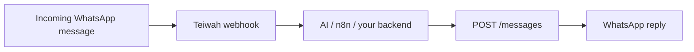

import { Card, CardGrid } from '@astrojs/starlight/components';

## How Teiwah works

Teiwah connects a WhatsApp number to your automation. The model is intentionally small:

<CardGrid stagger>
	<Card title="Send messages" icon="email">
		One endpoint, `POST /messages`, for text plus image, voice notes,
		audio, video, and documents — addressed by a single `chatId`.
	</Card>
	<Card title="Receive webhooks" icon="random">
		Inbound WhatsApp events — 1:1 and group — are delivered to your
		webhook URL in the same `chatId` + `text`/`media` shape you send.
	</Card>
	<Card title="Session API keys" icon="approve-check">
		Each connected WhatsApp session has its own Bearer key, issued by the
		Teiwah dashboard.
	</Card>
	<Card title="Media by URL" icon="open-book">
		Media is referenced by URL. Download inbound media on demand; send
		outbound media by URL or base64.
	</Card>
</CardGrid>

## Get started

1. Create a session and connect WhatsApp in the [Teiwah dashboard](https://teiwah.cloud/dashboard).
2. Copy the session API key.
3. Follow the [Quickstart](/guides/quickstart/) to send your first message.
